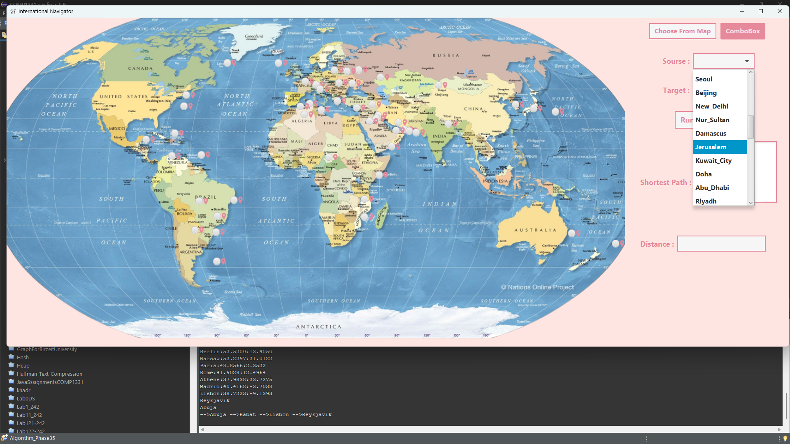
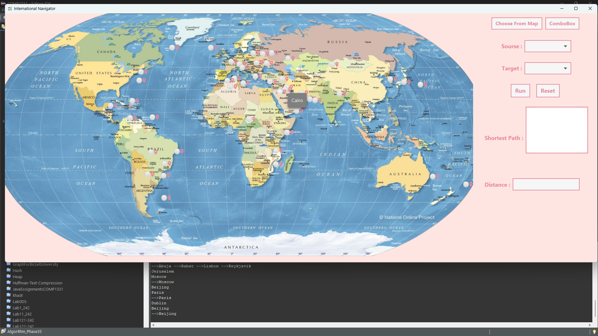

# WorldMapNavigator
A capital-to-capital route system i did in june 2024. It calculates optimal paths and distances between capitals. Choose from a map or combo box. Built for an algorithm course using java.

## Features

- **Interactive Map:** Choose capitals directly from a world map.
- **Combo Box Selection:** Select capitals from a dropdown list.
- **Optimal Path Calculation:** The program calculates the shortest path between the two selected capitals.
- **Distance Display:** The distance between the capitals is displayed in kilometers.

## How It Works

### Start Screen


1. **Choose from Map:**
   - Click on the map to select the first capital.
   - Click on another location to select the second capital.

2. **Choose from Combo Box:**
   - Select the first capital from the combo box.
   - Select the second capital from the combo box.

### Path Calculation

Once two capitals are selected, the program calculates the optimal path and displays the distance in kilometers.







## Installation

To run this project locally, follow these steps:

1. Clone the repository:
   ```bash
   git clone https://github.com/yourusername/WorldMapNavigator.git
